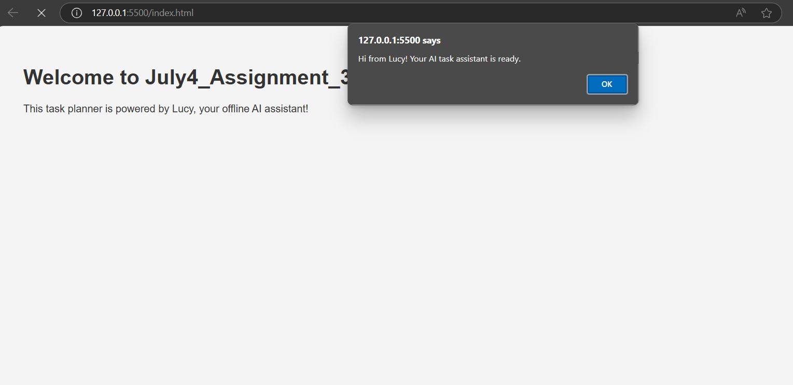

# July4_Assignment_3

## 📃 Description
A pretend open-source AI-based task planner powered by Lucy, a local assistant. This project demonstrates GitHub documentation and markdown skills.

## ✨ Features
- Smart task suggestions (offline AI - pretend)
- Easy-to-use interface
- Organized GitHub workflow with wiki

## 🔧 Technologies Used
- HTML5, CSS3, JavaScript (Vanilla)
- Git & GitHub

## 🐞 Known Bugs
- Fake AI (no backend logic)
- No database or persistent storage
- Minimal error handling

## 👥 Contributors
- [beebee1985](https://github.com/beebee1985)

## 📥 Installation
```bash
git clone https://github.com/beebee1985/July4_Assignment_3.git
cd July4_Assignment_3
# just open index.html in your browser
```

## ▶️ Usage
Open `index.html` in your browser.

## 🗂 Table of Contents
- [Description](#description)
- [Features](#features)
- [Technologies Used](#technologies-used)
- [Known Bugs](#known-bugs)
- [Contributors](#contributors)
- [Installation](#installation)
- [Usage](#usage)

## 📸 Screenshot


## 📜 License
MIT License
